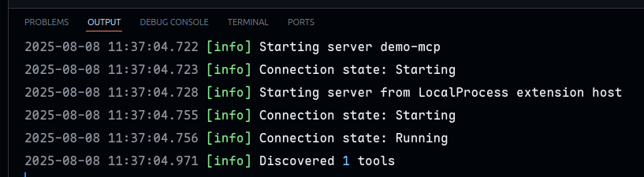
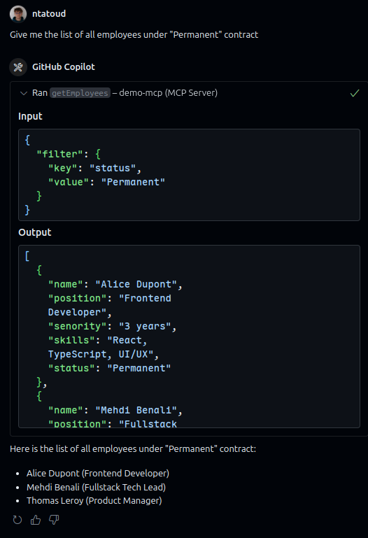

import { Link } from '@/components/ui/link';

import { MCPSchema } from './schema';

---

<div className="flex items-center gap-2">
  This article is also available in the following languages:
  <Link
    href="https://bearstudio.fr/"
    target="_blank"
    rel="noopener noreferrer"
    variant="secondary"
    size="sm"
  >
    🇫🇷 French
  </Link>
</div>

---

## Quick overview

In recent months, the efficiency of _LLMs_ has been growing rapidly, shaking up our developer workflows. More and more often, we rely on them to write code, debug, design, or assist us throughout our daily tasks, they’re becoming essential copilots.

> **LLM** (Large Language Model) is an AI trained on large amounts of text to **understand, generate, and reason in natural language**.

The general public has already adopted tools like ChatGPT (OpenAI), LeChat (Mistral), and other generative AI solutions.  
But beyond basic text exchanges and simple interactions, what if we went further? What if AI could **interact directly and autonomously with our tools**? Modify code? Query a database?  
That’s precisely what **AI agents** enable.

### What’s the difference between a **bot**, an **AI assistant**, and an **AI agent**?

**Bot**: a very simple program. It follows predefined rules and gives automated responses. For example, a chatbot on a website that offers canned replies (“Press 1 to speak to an advisor”).  
👉 **It doesn't truly understand, it just runs scripts.**

**AI Assistant** (like Siri, Alexa, or ChatGPT): more advanced. It understands what we say, responds naturally, and can perform simple tasks (send a message, run a search, etc.).  
👉 **It waits for input and executes what we ask, but it doesn't take initiative.**

**AI Agent**: the next level. It can **act on its own**, make decisions **without being told**, and adapt to what’s happening. For example, an AI agent could monitor your inbox, detect an important meeting, book a taxi, and notify you, without you having to ask.  
👉 **It’s autonomous, smart, and learns over time.**

_We won't go into detail about how AI agents work, but you can read this intro article from Google: [Google Cloud - What are AI agents?](https://cloud.google.com/discover/what-are-ai-agents?hl=fr)_

So far, one of the main constraints when creating an agent was building very specific, custom connectors for every data source and model. This approach is tedious, hard to scale, and rarely reusable.

---

## MCP: Here comes a new challenger

This is where the **Model Context Protocol (MCP)** comes in.  
Launched in late 2024 by **Anthropic** (the company behind Claude), this open-source protocol offers AI agents a simple, standardized, and secure way to connect to tools, data, and services, **without writing one-off integrations every time**.

### Theory: how does it work?

Behind the Model Context Protocol is a simple but powerful idea: allow an AI to **dynamically discover, query, and manipulate tools or services** without requiring a dedicated integration for each use case. MCP defines a standardized communication protocol between key players.

<MCPSchema />

#### The key roles:

**MCP Hosts**: apps like Claude Desktop, IDEs, or AI tools that want to access different capabilities or data sources via MCP.  
👉 **They send requests to enrich their context (code, files, docs, etc.) using the protocol.**

**MCP Clients**: intermediate components that handle a 1:1 connection with an MCP server.  
👉 **They translate host requests into calls to a specific MCP server and ensure the communication between them.**

**MCP Servers**: small standalone programs that expose a capability or data type through the MCP protocol (e.g. local files, Git history, knowledge base…).  
👉 **Each server is specialized and can be combined with others to expand a host’s capabilities.**

#### What about AI assistants in our IDEs?

The AI assistants we use today in development environments have evolved significantly. Initially designed to suggest code or answer simple questions, they're becoming **true intelligent agents**, capable of **understanding context**, **making decisions**, and **taking direct action** in our projects.

With the arrival of **agent mode**, these assistants gain autonomy and flexibility. They can now dynamically connect to external tools, databases, APIs, local files, Git history, etc. This enables them not only to better respond to our queries but also to proactively execute complex actions, adapting to each context.

**This is a major shift: the assistant becomes an actor, deeply integrated into our workflow.**

Adding MCP servers to these agents lets you **unlock custom capabilities**: accessing local data, querying business services, or manipulating specific files. It turns the agent into a **unified interface between AI and your tools**, without having to code every integration manually.

---

### Hands-on: building a simple MCP server with TypeScript and `@modelcontextprotocol/sdk`

#### 1. Context

Example employee data:

```json
[
  {
    "name": "Alice Dupont",
    "position": "Frontend Developer",
    "senority": "3 years",
    "skills": "React, TypeScript, UI/UX",
    "status": "Permanent"
  },
  {
    "name": "Mehdi Benali",
    "position": "Fullstack Tech Lead",
    "senority": "5 years",
    "skills": "Java, React, Architecture",
    "status": "Permanent"
  },
  {
    "name": "Julie Morel",
    "position": "QA Analyst",
    "senority": "2 years",
    "skills": "Automated testing, Cypress",
    "status": "Fixed-term"
  },
  {
    "name": "Thomas Leroy",
    "position": "Product Manager",
    "senority": "4 years",
    "skills": "Agile, Roadmap, Communication",
    "status": "Permanent"
  },
  {
    "name": "Claire Nguyen",
    "position": "Backend Developer",
    "senority": "1 year",
    "skills": "Node.js, PostgreSQL, Docker",
    "status": "Apprenticeship"
  },
  {
    "name": "Romain Garcia",
    "position": "UI/UX Designer",
    "senority": "2 years",
    "skills": "Figma, Accessibility, Design Systems",
    "status": "Freelance"
  }
]
```

Our goal here is to build a mini MCP server to fetch this list and use it from VSCode.

#### 2. Setup

Initialize a Node 24 project with pnpm:

```bash
$ mkdir demo-mcp
$ cd demo-mcp
$ pnpm init -y
```

Install the dependencies

```bash
$ pnpm add zod @modelcontextprotocol/sdk
```

We’ll only need a single file: main.ts.

#### 3. Building the MCP server

Let’s start building our server:

```ts title="main.ts" showLineNumbers
import { McpServer } from '@modelcontextprotocol/sdk/server/mcp.js';

const server = new McpServer({
  name: 'Employee Manager',
  version: '1.0.0',
  description: 'A demo MCP server',
});
```

Now let's add a tool to the server.

We need to define three important things:

<ul className="list-disc space-y-2 pl-4">
  <li>Tool name: `getEmployees`.</li>
  <li>
    {
      "Description: 'Fetches the list of all employees and applies filters if needed'. This helps the LLM understand when/how to use it."
    }
  </li>
  <li>
    {
      'Input schema: using Standard Schema, we’ll use zod to validate and describe parameters.'
    }
  </li>
  <li>The function that will execute.</li>
</ul>
Add this to your main.ts:

```ts title="main.ts" {1, 4, 12-36} showLineNumbers
import { McpServer } from '@modelcontextprotocol/sdk/server/mcp.js';
import { z } from 'zod';

import { getEmployees } from './getEmployees.ts';

const server = new McpServer({
  name: 'Employee Manager',
  version: '1.0.0',
  description: 'A demo MCP server',
});

server.tool(
  'getEmployees',
  'Fetches the list of all employees and applies filters if needed',
  {
    filter: z
      .object({
        key: z
          .enum(['name', 'post', 'senority', 'skills', 'status'])
          .describe('The employee table keys used for filtering'),
        value: z.string(),
      })
      .optional()
      .describe('Optional employee list filter'),
  },
  async ({ filter }) => {
    const employees = await getEmployees({
      where: filter?.key,
      value: filter?.value,
    });

    return {
      content: [{ type: 'text', text: JSON.stringify(employees, null, 2) }],
    };
  }
);
```

Great! Our server is nearly ready, but we still need to ensure MCP clients can communicate with it.
A simple solution is to use standard input/output streams (stdio/stdout).

Thankfully, the `@modelcontextprotocol/sdk` provides a built-in transport: `StdioServerTransport`.

```ts title="main.ts" {2, 39-40} showLineNumbers
import { McpServer } from '@modelcontextprotocol/sdk/server/mcp.js';
import { StdioServerTransport } from '@modelcontextprotocol/sdk/server/stdio.js';
import { z } from 'zod';

import { getEmployees } from './getEmployees.ts';

const server = new McpServer({
  name: 'Employee Manager',
  version: '1.0.0',
  description: 'A demo MCP server',
});

server.tool(
  'getEmployees',
  'Fetches the list of all employees and applies filters if needed',
  {
    filter: z
      .object({
        key: z
          .enum(['name', 'post', 'senority', 'skills', 'status'])
          .describe('The employee table keys used for filtering'),
        value: z.string(),
      })
      .optional()
      .describe('Optional employee list filter'),
  },
  async ({ filter }) => {
    const employees = await getEmployees({
      where: filter?.key,
      value: filter?.value,
    });

    return {
      content: [{ type: 'text', text: JSON.stringify(employees, null, 2) }],
    };
  }
);

const transport = new StdioServerTransport();
await server.connect(transport);
```

And that’s it, our server is now ready. Let’s connect it to VSCode !

#### 4. Using the MCP server with VSCode

Hit `Crtl+Shift+P` to open the command palette.<br />
Choose `Preferences: Open Workspace Settings (JSON)`.

Add the following configuration to your workspace settings:

```json title=".vscode/settings.json" showLineNumbers
{
  "mcp": {
    "servers": {
      "demo-mcp": {
        "command": "npx",
        "args": ["node", "/path-to-your-project/demo-mcp/main.ts"]
      }
    }
  }
}
```

Now the AI agent can access the MCP server and the tools it exposes.

To start the server, hit `Crtl+Shift+P` again and choose `MCP: List Servers`. Select the `demo-mcp` server you just created. and `Start Server`.

You should be seeing:



Now try asking it something like:
"Give me the list of employees with a permanent contract."

(Here the model used is claude-3.5-sonnet, but that doesn’t really matter.)

The LLM will understand that it can call the tool on our server, choose the right parameters, fetch the data, and return a formatted answer.



## What to expect next ?

Since early 2025, MCP adoption has skyrocketed. More and more players, from startups to big platforms, are contributing to the ecosystem by publishing MCP servers that can interact with all kinds of systems: codebases, databases, internal APIs, files, and more.
Names like Microsoft, Cloudflare, OpenAI, and framework/IDE vendors are already involved.

MCP is rapidly becoming the standard for interoperability between AI and business tools. Where we once cobbled together rigid connectors, we now have a modular, declarative, and secure protocol designed to collaborate natively with language models.

This opens up a whole new range of possibilities: custom agents, smart automation, assistants that can navigate codebases or analyze logs in context, even high-level actions like deployment orchestration or environment management.

And all of that without strong tech dependencies: MCP is open, extensible, and agnostic, allowing any tool or service to expose capabilities on demand.

So if you're curious, give it a try. Build your own servers, expose your tools, and share your experience with the community.

---

### Resources

👉 Introduction - Model Context Protocol (Anthropic)

👉 Build an MCP Server in 5 Steps // Effective Coding (Matt Pocock)
